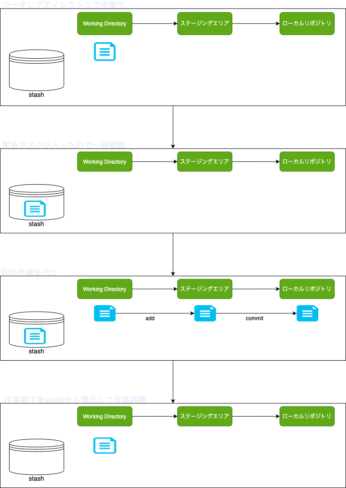

# stashコマンドの使い方
現在作業中のファイルを一時避難させておくことができます。例えば、緊急で作業すべきファイルが出てきた場合、ブランチを間違えて作業していた場合などに使用することができます。

## 流れ
stashは、現在ワーキングディレクトリにあるファイルのみを対象として避難させます。stashして、ワーキングディレクトリに戻す場合には、そのファイルのコピーが復元される形になるため、復元後はstash側で削除する必要があります。（popコマンドを使えば同時にできる）  
  
ワーキングディレクトリにあるイメージを避難させるのは、このようなイメージです。

{: align=left }

### 基本の流れ
```shell
# 現在作業中のファイルを避難させる（stash）
git stash

# 避難させているファイルの一覧を確認する
git stash list

# 何か他の作業を行う

# 避難させていたファイルをワーキングディレクトリに戻す
git stash apply

# stashされていたファイルを削除する（コピーはワーキングディレクトリにある状態で）
git stash drop

# stashされた中で最も新しいファイルを apply と drop 同時に行うには
git stash pop
```

### 応用編
stashされたファイルは、最も新しいものから順に、 0, 1, 2, 3 ... と番号が振られている。

```shell
# トラックされていないファイルも含めてstashする
git stash -u

# ignoreされているファイルも含めてstashする
git stash -a

# stashされているファイルの中身を確認する
git stash show stash@{番号}

# stashメッセージをつける
git stash save 'メッセージ'

# 特定のstashのみapplyする
git stash apply stash@{番号}

# 特定のstashのみdropする
git stash drop stash@{番号}

# 特定のstashのみpopする
git stash pop stash@{番号}
```