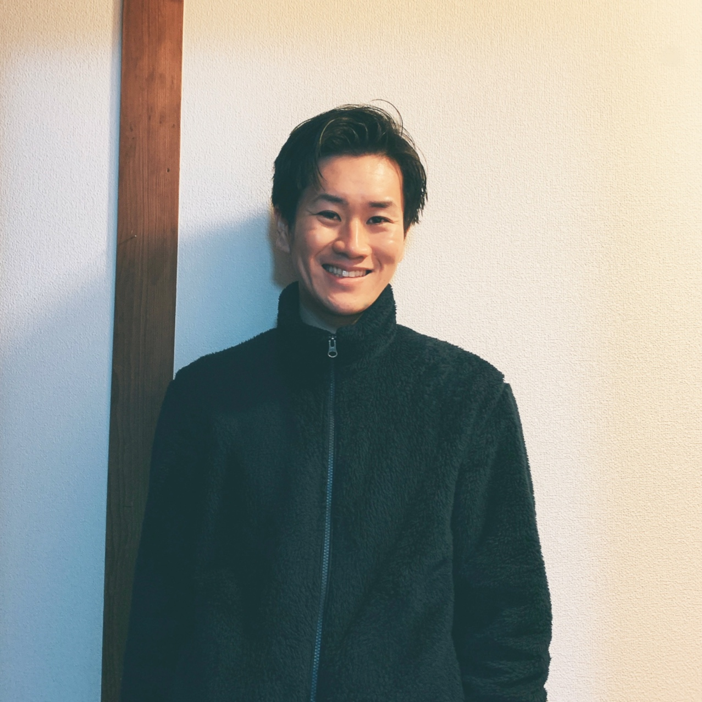

<strong style="color: red; ">
ただいま転職活動中です！興味を持っていただけましたらご連絡ください！
</strong>

{: align=left width=314 }

  <button data-md-color-scheme="default"><a class="md-button" style="margin: 10px 30px">ライト</a></button>
  <button data-md-color-scheme="slate"><a class="md-button md-button--primary" style="margin: 10px 30px">ダーク</a></button>

|                |                                              |
| -------------- | -------------------------------------------- |
| **希望職種**   | :material-check: バックエンドエンジニア      |
| **資格**   | :material-check: [AWS認定 SAA](https://www.youracclaim.com/badges/016070fc-6168-4625-8a8d-1bde0b908984/public_url)      |
| **学習中**     | :material-check: Ruby / Rails / AWS / Docker |
| **希望勤務地** | :material-check: 福岡                        |

## パーソナル情報

- 松尾 福太郎（まつお ふくたろう）
- 1993 年 9 月 1 日 / 27 歳

## 経歴

- 2017 年 3 月 / 長崎リハビリテーション学院 卒業
- 2017 年 4 月 / 長崎県内の病院 就職（理学療法士）

2017 年の 3 月に理学療法士の国家試験を取得。

実習地の病院にスカウトをいただき、勉強熱心な職員に憧れ入社しました。入社後は、外来リハビリ部門に配属されました。

当時の外来リハビリ部門の課題は、ほとんどの書類業務が手書きで行われていることでした。それに対し Excel を勉強して、書類業務の改善を提案しました。

その結果、本来のリハビリ業務に充てられる時間が増え、入社 2 年目の年には年間患者数が前年比+15%を達成し、月間の外来患者数は過去 1 位を記録することができました。

自分が知らない分野のことでも、まずは挑戦して、継続して学ぶ習慣がこのとき身につきました。

また、この実績が認められ、外来リハビリ部門の顧客と収益の管理を任されました。

管理も Excel で行っていたのですが、

- ブックとシートが複数に分かれ煩雑になっていること
- 共有が難しいこと
- プログラミングに興味があったこと

から、Ruby on Rails を使用して管理アプリを自作し、2020 年 4 月から運用しています。

使用した職員から、嬉しい言葉をいただくことも多く、日々フィードバックをいただき、改善を重ねる経験もできました。

普通はやろうと思わないような取り組みをやり遂げて、状況が好転する時に最も喜びを感じます。

またこの経験がきっかけで、エンジニアという仕事に就きたいと強く思うようになり、現在転職活動中です。

- 2021 年 3 月 退職予定
- 現在転職活動中

<u>詳しくは**[Wantedly](https://www.wantedly.com/id/fukutaro_matsuo)**に記載していますので、そちらも読んで頂けると幸いです。</u>

## 学習したプログラミングスキル

- **HTML**
- **CSS**
- **Javascript**
- **Vue**  
  バックエンドにRails-apiを用いた、デモアプリの作成
- **Ruby**  
  条件分岐、繰り返し処理、配列、ハッシュ、オブジェクト指向
- **Ruby on Rails**  
  ActiveRecord(CRUD 処理）、ログイン機能、管理者画面機能、グラフ描画（chartkick）、インポート処理（CSV 出力）、テストコード実装
- **Git GitHub**  
  基本コマンド（add、commit、push）、疑似チーム開発（checkout、merge、プルリクエスト）
- **Docker**  
  各種コマンド(build、up、down 等)、docker-compose（rails + postgres や python で作成されている mkdocs、 rails-api + nuxt.js + mysql）
- **CercleCi TravisCi**  
  自動テスト、自動 deploy
- **AWS**  
      - VPC、EC2(ECR+ECS)、RDS、ELB、ACM、Route53 を使用した Web アプリのデプロイ経験  
      - Amplify を使用した、静的サイトの自動デプロイの経験
      - [AWS認定 ソリューションアーキテクトアソシエイト（SAA）を取得](https://www.youracclaim.com/badges/016070fc-6168-4625-8a8d-1bde0b908984/public_url)

## どのような業務をしたいか

- 常に新しいことに挑戦し、変化し続ける
- 資格取得や学習を促すような文化がある
- 使った人が感動するような画期的なアプリの開発に関わることができる

## どのようなエンジニアになりたいか

「課題を見つけ、解決する能力を身につけ、多くの人の役に立てる」エンジニアになりたいと考えています。

#### 課題を見つける

現職でも、問題となっている箇所や、当たり前とされている箇所に常に改善できる余地はないかと考えて仕事をしていました。
言われたことをただやるのでは無く、常に考え続けて業務にあたる姿勢を忘れないようにしたいです。

#### 解決する能力を身につける

課題を見つけて終わりではなく、それを解決する技術を身につけたいです。
自分が実装したことがない技術も、まずは挑戦して、実装できるまで諦めないというマインドを持って学習してきました。
また、習得した技術はアウトプットして、周囲に提供していきたいと考えております。

#### 多くの人の役に立つ

関わったプロダクトを通して、一人でも多くの人の課題を解決し、少しでも役に立つことができるようなエンジニアになりたいです。
現職で運用している管理アプリでも、職員の作業を軽減することで、感謝されることがありました。
その経験がエンジニアを志望するきっかけになったので、より多くの人の役に立つことができるようなエンジニアになりたいです。

## 自作アプリ

### 職場の顧客 & 収益管理アプリ（Ruby on Rails）

**URL: [https://www.rehakanri.tk](https://www.rehakanri.tk)**

※ 名前、数字は全てサンプルです。現在ログイン制限をしているため、[Twitter](https://twitter.com/fukusan0901)に DM 頂けると、ID、PassWord を教えることが可能です。

1. **収益ページサンプル**
   {: align=left }
2. **患者情報ページサンプル**
   {: align=left }

#### 概要

- リハビリの患者情報と収益情報を管理するアプリ
- 主な入力欄は、当日患者名と新規患者名
- 収益ページでは、当日患者情報をもとに各種数字を算出する
- 患者ページでは、リハビリ離脱率を下げるための定期目標も管理

#### こだわりポイント

- materalize css を使用した、レスポンシブ対応のシンプルなデザイン
- Chartkick.js を使用してのわかりやすいグラフ描画
- 新規登録不可で、管理者が登録した場合のみログイン可能(二段階認証導入予定)
- ActiveRecord メソッドや生の SQL を使って、収益等、あらゆる数字を算出
- 日報一覧ページでは、当日の全患者情報を閲覧でき、CSV 形式で出力することができる

**他にも細かい便利な機能や、毎日の集計に 5~10 分はかかるような時間短縮できる機能を取り入れています。**

## SNS

- :fontawesome-brands-twitter: - [Twitter](https://twitter.com/fukusan0901)
- :fontawesome-brands-github: - [GitHub](https://github.com/FukutaroMatsuo)
- :fontawesome-solid-search: - [Qiita](https://qiita.com/fukusan0901)
- :fontawesome-regular-address-card: - [Wantedly](https://www.wantedly.com/id/fukutaro_matsuo)
